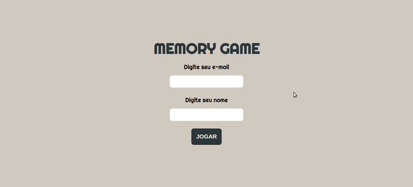
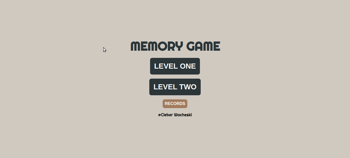
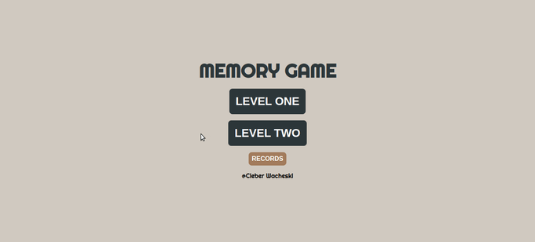

<h1 align="center">Memory Game</h1>

<p align="left">Jogo da memoria usando React JS e CSS modules</p>

##

<br>


<h1 align="left">
  
  
  
  
</h1>


## Demonstração :rocket: 

[MEMORY GAME - Vercel](https://memory-game-sigma-gray.vercel.app/)

## Back-end: :computer:

[Link do repositorio](https://github.com/CleberWacheski/Memory-Game-BackEnd-Serverless) :arrow_right: (Serverless) Usando Api Routes do Next JS <br/>

[Link do repositorio](https://github.com/CleberWacheski/MemoryGame-NodeJS) :arrow_right: Usando NodeJS/Express


## Tecnologias :hammer_and_pick:

As seguintes ferramentas foram usadas na construção do projeto:

- [x] [Vite](https://vitejs.dev/)
- [x] [TypeScript](https://www.typescriptlang.org/)
- [x] [React JS](https://pt-br.reactjs.org/)
- [x] [Context API](https://pt-br.reactjs.org/docs/context.html)
- [x] [Zod](https://github.com/colinhacks/zod)
- [x] [Css-modules](https://github.com/css-modules/css-modules)
- [x] [UUID](https://www.npmjs.com/package/uuid) 
- [x] [REACT-HOOK-FORM](https://react-hook-form.com/)
- [x] [Axios](https://axios-http.com/ptbr/docs/intro)

## Pré-requisitos

Antes de começar, você vai precisar ter instalado em sua máquina as seguintes ferramentas:
[GIT](https://git-scm.com/), [Node.js](https://nodejs.org/en/).

Além disto é bom ter um editor para trabalhar com o código como [VSCode](https://code.visualstudio.com/)


## Rodando o App

```bash
# Clone este repositório
$ git clone https://github.com/CleberWacheski/Memory-Game-ReactJS
# Acesse a pasta do projeto no terminal/cmd
$ cd Memory-Game-ReactJS
# Instale as dependências
$ npm install 
# Inicie o expo
$ npm run dev
```


